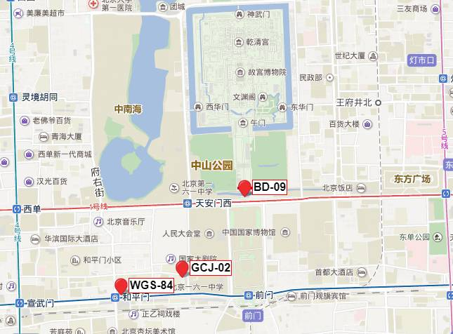

# gcoord

[](https://www.npmjs.com/package/gcoord)
[](https://codecov.io/gh/hujiulong/gcoord)
[](https://unpkg.com/gcoord/dist/gcoord.js)
[](https://www.npmjs.com/package/gcoord)
[](https://996.icu)

**gcoord**(**g**eographic **coord**inates)是一个处理地理坐标系的js库，用来修正百度地图、高德地图及其它互联网地图坐标系不统一的问题

(**gcoord** is a JS library for converting Chinese geographic coordinate encryption. In most cases, only Chinese developers need to use it, so there is no English document. If you need an English document, please open a new issue)

### Features
* **轻量** - 无外部依赖，gzip后大小仅2kb
* **兼容性强** - 能在node环境以及所有现代浏览器（IE8+）中运行
* **稳定高效** - 100%测试覆盖
* **多坐标系支持** - 支持转换互联网地图中所有常见坐标系，可以任意相互转换
* **多格式支持** - 支持转换坐标数组和GeoJSON
* **支持TypeScript** - 支持TypeScript项目

### 为什么需要转换坐标系？
因为国内对地理坐标有特殊的政策，所有电子地图必须对位置做偏移处理，这导致了从底层接口得到的经纬度坐标展示在地图上会有偏移。这种偏移不是线性的，不能简单地通过加减某个值来校正，并且不同的地图提供商采用的算法也不一样，例如百度地图和高德地图就采用了不同的偏移方式。更详细的信息可以阅读下文的[关于坐标系](#关于坐标系)。
> 导航电子地图在公开出版、销售、传播、展示和使用前，必须进行空间位置技术处理。<br> — GB 20263―2006《导航电子地图安全处理技术基本要求》，4.1

## 安装
通过npm安装:
```bash
npm install gcoord --save
```
或者直接在页面中引入:
```html
<script src="https://unpkg.com/gcoord/dist/gcoord.js"></script>
```
## 引入
CommonJS:
```js
const gcoord = require('gcoord');
// 或者
const { transform, WGS84, GCJ02 } = require('gcoord');
```
ES Module:
```js
import gcoord from 'gcoord'
// 或者
import { transform, WGS84, GCJ02 } from 'gcoord'
```
同时也支持AMD和CMD规范


## 使用
例如从手机的GPS得到一个经纬度坐标，需要将其展示在百度地图上，则应该将当前坐标从[WGS-84](#wgs-84---世界大地测量系统)坐标系转换为[BD-09](#bd-09---百度坐标系)坐标系
```js
var result = gcoord.transform(
  [116.403988, 39.914266],    // 经纬度坐标
  gcoord.WGS84,               // 当前坐标系
  gcoord.BD09                 // 目标坐标系
);

console.log(result);  // [116.41661560068297, 39.92196580126834]
```
同时gcoord还可以转换GeoJSON对象的坐标系，详细使用方式可以参考[API](#api)

## API

### transform(input, from, to)
进行坐标转换

**参数**
-   `input` **[GeoJSON][GeoJSON] | [string][string] | [Array][Array]&lt;[number][number]>** GeoJSON对象，或GeoJSON字符串，或经纬度数组
-   `from` **[CRS](#crs)** 当前坐标系
-   `to` **[CRS](#crs)** 目标坐标系

**返回值**

**[GeoJSON][GeoJSON] | [Array][Array]&lt;[number][number]>**

**示例**
```js
// 将GCJ02坐标转换为WGS84坐标
var result = gcoord.transform([123, 45], gcoord.GCJ02, gcoord.WGS84);
console.log(result);  // [122.99395597, 44.99804071]
```

```js
// 转换GeoJSON坐标
var geojson = {
  "type": "Point",
  "coordinates": [123, 45]
}
gcoord.transform(geojson, gcoord.GCJ02, gcoord.WGS84);
console.log(geojson.coordinates); // [122.99395597, 44.99804071]
```

返回数组或GeoJSON对象（由输入决定），**注意：当输入为GeoJSON时，transform会改变输入对象**

### CRS
CRS为坐标系，目标支持以下几种坐标系

| CRS                | 坐标格式   | 说明    |
| --------           | --------- | ----- |
| gcoord.WGS84       | [lng,lat] | WGS-84坐标系，GPS设备获取的经纬度坐标   |
| gcoord.GCJ02       | [lng,lat] | GCJ-02坐标系，google中国地图、soso地图、aliyun地图、mapabc地图和高德地图所用的经纬度坐标   |
| gcoord.BD09        | [lng,lat] | BD-09坐标系，百度地图采用的经纬度坐标    |
| gcoord.BD09LL      | [lng,lat] | 同BD09  |
| gcoord.BD09MC      | [x,y]     | BD-09米制坐标，百度地图采用的米制坐标，单位：米  |
| gcoord.BD09Meter   | [x,y]     | 同BD09MC |
| gcoord.Baidu       | [lng,lat] | 百度坐标系，BD-09坐标系别名，同BD-09  |
| gcoord.BMap        | [lng,lat] | 百度地图，BD-09坐标系别名，同BD-09  |
| gcoord.AMap        | [lng,lat] | 高德地图，同GCJ-02  |
| gcoord.WebMercator | [x,y]     | Web Mercator投影，墨卡托投影，同EPSG3857，单位：米 |
| gcoord.WGS1984     | [lng,lat] | WGS-84坐标系别名，同WGS-84  |
| gcoord.EPSG4326    | [lng,lat] | WGS-84坐标系别名，同WGS-84  |
| gcoord.EPSG3857    | [x,y]     | Web Mercator投影，同WebMercator，单位：米  |
| gcoord.EPSG900913  | [x,y]     | Web Mercator投影，同WebMercator，单位：米  |

**支持更多坐标系？**
gcoord的目标是处理web地图中的坐标，目前支持的坐标系已经能满足绝大部分要求了，同时gcoord也能保持轻量。如果需要更专业的坐标系处理工具，可以使用[proj4js](https://github.com/proj4js/proj4js)等开源库

## 关于坐标系
我们通常用经纬度来表示一个地理位置，但是由于一些原因，我们从不同渠道得到的经纬度信息可能并不是在同一个坐标系下。

* 高德地图、腾讯地图以及谷歌中国区地图使用的是**GCJ-02**坐标系
* 百度地图使用的是**BD-09**坐标系
* 底层接口(HTML5 Geolocation或ios、安卓API)通过GPS设备获取的坐标使用的是**WGS-84**坐标系

不同的坐标系之间可能有几十到几百米的偏移，所以在开发基于地图的产品，或者做地理数据可视化时，我们需要修正不同坐标系之间的偏差。


### WGS-84 - 世界大地测量系统
WGS-84（World Geodetic System, WGS）是使用最广泛的坐标系，也是世界通用的坐标系，GPS设备得到的经纬度就是在WGS84坐标系下的经纬度。通常通过底层接口得到的定位信息都是WGS84坐标系。

### GCJ-02 - 国测局坐标
GCJ-02（G-Guojia国家，C-Cehui测绘，J-Ju局），又被称为火星坐标系，是一种基于WGS-84制定的大地测量系统，由中国国测局制定。此坐标系所采用的混淆算法会在经纬度中加入随机的偏移。

国家规定，**中国大陆所有公开地理数据都需要至少用GCJ-02进行加密**，也就是说我们从国内公司的产品中得到的数据，一定是经过了加密的。绝大部分国内互联网地图提供商都是使用GCJ-02坐标系，包括高德地图，谷歌地图中国区等。

### BD-09 - 百度坐标系
BD-09（Baidu, BD）是百度地图使用的地理坐标系，其在GCJ-02上多增加了一次变换，用来保护用户隐私。从百度产品中得到的坐标都是BD-09坐标系。

<p align="center">
  
  <p align="center">不同坐标系下的点在百度地图上会有偏移</p>
</p>

### 相互转换
GCJ-02和BD-09都是用来对地理数据进行加密的，所以也不会公开逆向转换的方法。理论上，GCJ-02的加密过程是不可逆的，但是可以通过一些方法来逼近接原始坐标，并且这种方式的精度很高。gcoord使用的纠偏方式达到了厘米级的精度，能满足绝大多数情况。

## TODO
- [ ] CLI工具
- [ ] 转换GeoJSON文件

有其他需求请提issue，也欢迎提交PR


## LICENSE
MIT

[number]: https://developer.mozilla.org/en-US/docs/Web/JavaScript/Reference/Global_Objects/Number
[string]: https://developer.mozilla.org/en-US/docs/Web/JavaScript/Reference/Global_Objects/String
[Array]: https://developer.mozilla.org/en-US/docs/Web/JavaScript/Reference/Global_Objects/Array
[Object]: https://developer.mozilla.org/en-US/docs/Web/JavaScript/Reference/Global_Objects/Object
[Error]: https://developer.mozilla.org/en-US/docs/Web/JavaScript/Reference/Global_Objects/Error

[GeoJSON]: https://tools.ietf.org/html/rfc7946#page-6
